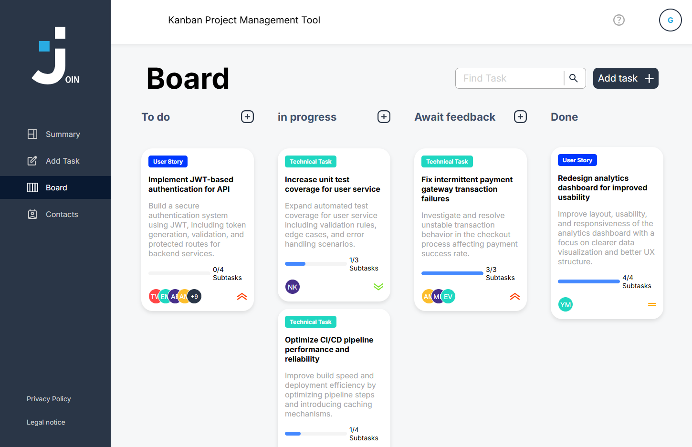

# Join - Kanban Task Management Application

## 📖 About the Project

**Join** is a Kanban-style web application for task and workflow management.  
It allows users to create tasks, manage contacts, assign responsibilities, and track progress through subtasks and visual status updates.

---

## 📸 Preview




---

## ✨ Key Features

### 📋 Kanban Board

- 4-column Kanban system (To Do, In Progress, Await Feedback, Done)
- Drag & drop task movement (desktop and mobile support)
- Visual task cards with priority and assignment overview

### 🧩 Task Management

- Create, edit, and delete tasks
- Add subtasks and track completion progress
- Assign contacts to tasks
- Detailed task view with full information

### 👥 Contact Management

- Create and manage contacts
- Assign contacts directly to tasks
- Centralized contact list for better organization

### 🔍 Productivity Features

- Search and filter tasks
- Clear visual workflow and status tracking
- Dashboard-style overview of task distribution

### 📱 Responsive Design

- Mobile-first design (320px+ support)
- Optimized for touch and desktop interactions
- Consistent UI across all devices

### 🔥 Technical Setup

- Firebase Authentication (login and session handling)
- Firestore database for real-time data storage
- Modular project structure with clean code principles

---

## 🛠️ Tech Stack

### Frontend

- Vanilla JavaScript (ES6+)
- HTML5
- CSS3

### Backend & Authentication

- Firebase Firestore (NoSQL database)
- Firebase Authentication

### Architecture

- Multi-Page Application (MPA)
- Modular code structure

### Development Tools

- Live Server (local development)
- Git & GitHub (version control)
- JSDoc (code documentation)

---

## 📁 Project Structure

```text
join/
├── assets/
│   ├── fonts/
│   ├── icons/
│   └── imgs/
├── html/
│   ├── add-task.html
│   ├── board.html
│   ├── contacts.html
│   ├── help.html
│   ├── legal-notice.html
│   ├── legal-notice-external.html
│   ├── privacy-policy.html
│   ├── privacy-policy-external.html
│   ├── signup.html
│   ├── summary.html
│   └── templates.html
├── scripts/
│   ├── add-task/
│   ├── board/
│   ├── contacts/
│   ├── header.js
│   ├── signup.js
│   └── summary.js
├── styles/
│   ├── add-task/
│   ├── board/
│   ├── contacts/
│   ├── assets.css
│   ├── buttons.css
│   ├── fonts.css
│   ├── help.css
│   ├── index.css
│   ├── index-responsive.css
│   ├── legal-notice.css
│   ├── privacy-policy.css
│   ├── standard.css
│   ├── summary.css
│   ├── summary-responsive.css
│   ├── templates.css
│   └── templates-responsive.css
├── index.html
├── script.js
├── robots.txt
└── README.md
```

---

## �🚀 Installation & Setup

### 1. Clone the repository

```bash
git clone https://github.com/AnnikaEgger/join
cd join
```
